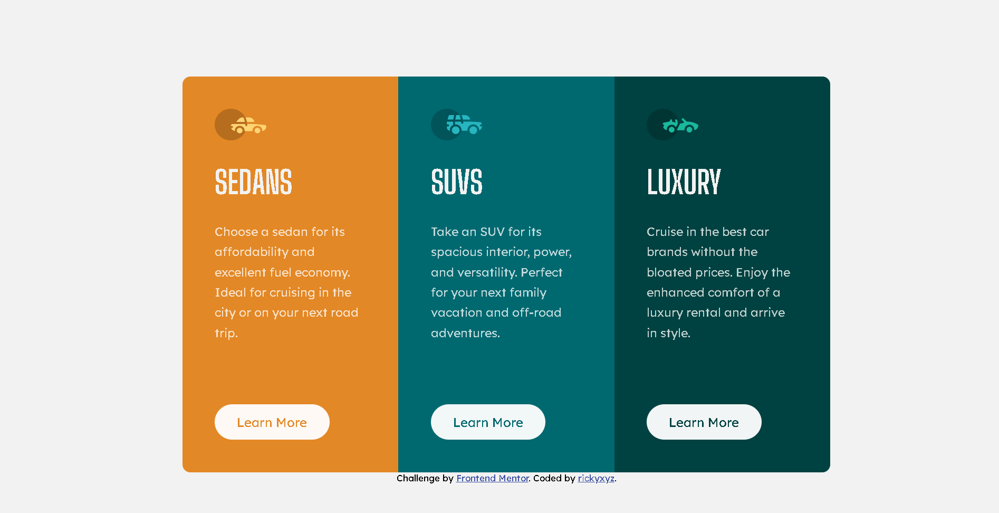
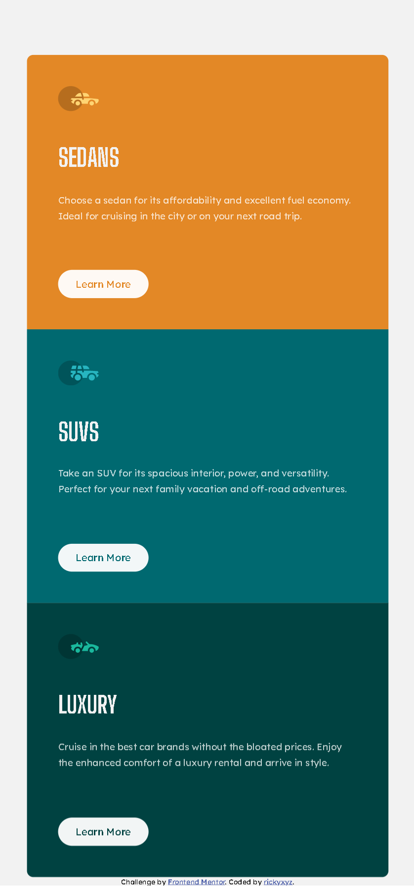

# Frontend Mentor - 3-column preview card component solution

This is a solution to the [3-column preview card component challenge on Frontend Mentor](https://www.frontendmentor.io/challenges/3column-preview-card-component-pH92eAR2-). Frontend Mentor challenges help you improve your coding skills by building realistic projects. 

## Table of contents

- [Overview](#overview)
  - [The challenge](#the-challenge)
  - [Screenshot](#screenshot)
  - [Links](#links)
- [My process](#my-process)
  - [Built with](#built-with)
  - [What I learned](#what-i-learned)
  - [Continued development](#continued-development)
  - [Useful resources](#useful-resources)
- [Author](#author)

## Overview

### The challenge

Users should be able to:

- View the optimal layout depending on their device's screen size
- See hover states for interactive elements

### Screenshot


Screenshot from desktop screen


Screenshot from mobile device (portrait)


Screenshot from mobile device (landscape)

### Links

- [Link to solution repository](https://github.com/rickyxyz/frontendmentor-projects/tree/main/3-column-preview-card-component-main)
- [Link to live site](https://rickyxyz.github.io/frontendmentor-projects/3-column-preview-card-component-main/index.html)

## My process

### Built with

- Semantic HTML5 markup
- CSS custom properties
- Flexbox

### What I learned

Overall, I think this project is quite straightforward for me. The only hiccups I had is how to make the buttons look right and how to make the elements look good on different screen sizes.

For the buttons, I decided to make the button text transparent so it shows the background color.

```css
button {
    ...
    /* code to make the text see through */
    background-color: var(--very-light-gray);
    mix-blend-mode: screen;
    ...
}
```

Another hiccups I faced, is how to make the elements responsive. It took quite a while and a lot of experimenting to solve this. The easier solution would be to create multiple media rules to accomodate different sizes. However, I don't like that approach since I think it will make the code harder to maintain. So, I decided to use a bunch of relative units, min(), and flex-grow to solve this.

```css
/* me trying to make elements more responsive */

.card__section > h1 {
    /* ... */
    margin-top: min(50px, 15%);
    flex-grow: 1;
    /* ... */
}

.card__section > p {
    line-height: 1.6rem;
    flex-grow: 3;
}

@media screen and (max-width: 900px){
    /* ... */
    .card__section {
        /* ... */
        padding: min(50px, 15%);
        /* ... */
    }

    .card__section p {
        flex-grow: 1;
    }
}
```

### Continued development

Until the end of this project, I am still not confident in my naming convention. I have been trying to use BEM naming convention, but still unsure.

I also still need to speed up my process of figuring out how to make element more responsive on different screen size.

### Useful resources

- [Stackoverflow: Button with Transparent Text](https://stackoverflow.com/questions/52319787/css-button-with-transparent-text) - From this thread I figured out how to make button with transparent text.
- [MDN mix-blend-mode docs](https://developer.mozilla.org/en-US/docs/Web/CSS/mix-blend-mode) - I looked up keyword values for mix-blend-mode from the documentation.

## Author

- Website - [rickyxyz.github.io](https://rickyxyz.github.io/)
- Frontend Mentor - [@rickyxyz](https://www.frontendmentor.io/profile/rickyxyz)