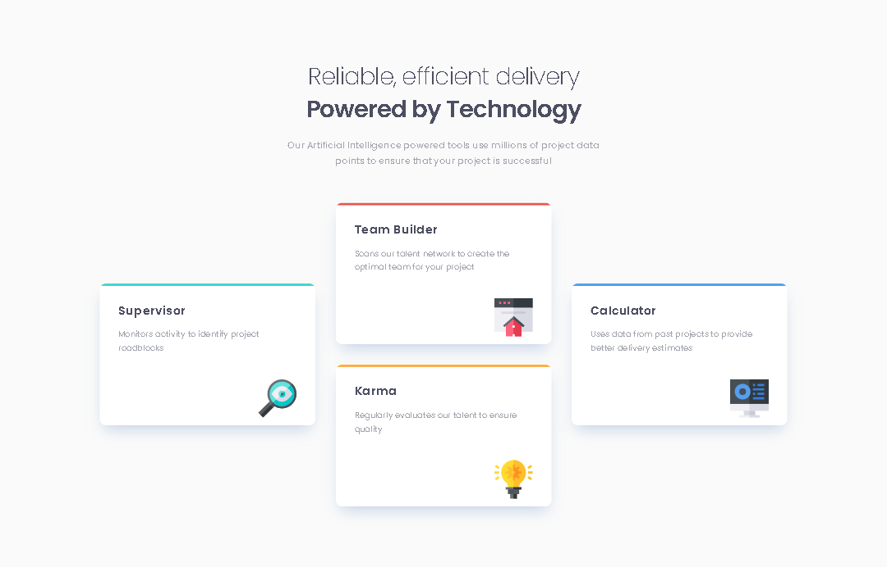

# Frontend Mentor - Four card feature section solution

This is a solution to the [Four card feature section challenge on Frontend Mentor](https://www.frontendmentor.io/challenges/four-card-feature-section-weK1eFYK). Frontend Mentor challenges help you improve your coding skills by building realistic projects. 

## Table of contents

- [Overview](#overview)
  - [The challenge](#the-challenge)
  - [Screenshot](#screenshot)
  - [Links](#links)
- [My process](#my-process)
  - [Built with](#built-with)
  - [What I learned](#what-i-learned)
  - [Continued development](#continued-development)
- [Author](#author)

**Note: Delete this note and update the table of contents based on what sections you keep.**

## Overview

### The challenge

Users should be able to:

- View the optimal layout for the site depending on their device's screen size

### Screenshot


result on screen wider than 1200px


result on mobile screen

### Links

- Solution URL: [Link to solution repository](https://github.com/rickyxyz/frontendmentor-projects/tree/main/four-card-feature-section-master)
- Live Site URL: [Link to live site](https://rickyxyz.github.io/frontendmentor-projects/four-card-feature-section-master/index.html)

## My process

### Built with

- Semantic HTML5 markup
- CSS custom properties
- Flexbox
- CSS Grid
- Mobile-first workflow

### What I learned

In this challenge I practiced using CSS grids.


The grid section for the cards.

```css
/* the code used for grid */
.wrapper {
    justify-content: center;
    justify-items: center;
    display: grid;
    gap: 3.6vh;
}

@media screen and (min-width: 1200px) {
    ...
        .wrapper {
        margin-top: -5vh;
        grid-template-areas: "l mt r" "l mb r";
    }
    ...
}
```

I think the card section turned out pretty well, but there is another problem I faced, that I still couldn't solve. So, the result doesn't look so close to the design. 


gap issue with flexbox

I used flexbox to separate the header and cards section, however using flexbox gap the cards section overflowed into the gap. Till the end, I couldn't figure out how to not make the cards section overflow. However, I decided to move on. Since the longer I tried the lower the return I got from this challenge.

### Continued development

I would like to revisit this challenge once more in the future, once I have learned and practiced more.

## Author

- Website - [rickyxyz.github.io](https://www.rickyxyz.github.io)
- Frontend Mentor - [@rickyxyz](https://www.frontendmentor.io/profile/rickyxyz)