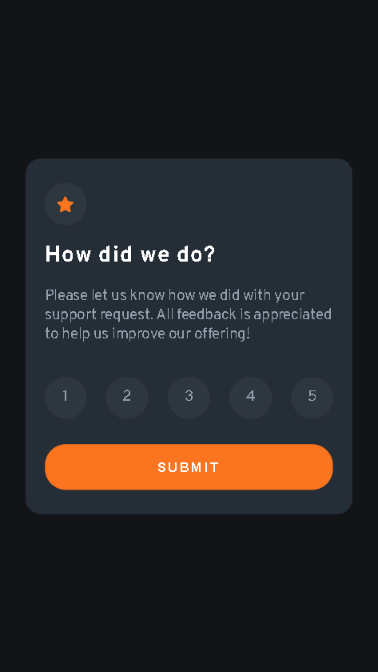

# Frontend Mentor - Interactive rating component solution

This is a solution to the [Interactive rating component challenge on Frontend Mentor](https://www.frontendmentor.io/challenges/interactive-rating-component-koxpeBUmI). Frontend Mentor challenges help you improve your coding skills by building realistic projects.

## Table of contents

- [Overview](#overview)
  - [The challenge](#the-challenge)
  - [Screenshot](#screenshot)
  - [Links](#links)
- [My process](#my-process)
  - [Built with](#built-with)
  - [What I learned](#what-i-learned)
  - [Continued development](#continued-development)
  - [Useful resources](#useful-resources)
- [Author](#author)

**Note: Delete this note and update the table of contents based on what sections you keep.**

## Overview

### The challenge

Users should be able to:

- View the optimal layout for the app depending on their device's screen size
- See hover states for all interactive elements on the page
- Select and submit a number rating
- See the "Thank you" card state after submitting a rating

### Screenshot

screenshot on desktop screen

screenshot of active state on desktop screen

screenshot of thank you card on desktop screen

screenshot on mobile device

### Links

- Solution URL: [Link to solution repository](https://github.com/rickyxyz/frontendmentor-projects/tree/main/interactive-rating-component-main)
- Live Site URL: [Link to live site](https://rickyxyz.github.io/frontendmentor-projects/interactive-rating-component-main/index.html)

## My process

### Built with

- Semantic HTML5 markup
- CSS custom properties
- SCSS
- Flexbox
- Mobile-first workflow

### What I learned

With this project I learned how to use SCSS and how to do things with JavaScript without the framework. While using a framework might make my job easier, I think it is better to learn basic JS first (also, I think using framework is overkill for this project).

This is also the first time I used SCSS, so I needed to go back and forth looking at the documentation to figure some things out. From my past experience using only CSS, I can definitely see the appeal of using a preprocessor. Though I still have much to learn about preprocessor, I can say that using preprocessor made my stylesheet easier to maintain.

This project definitely took longer to finish than I would like to,x because of the learning process involved (and other real life stuff going on).

### Continued development

I would like to keep using SCSS in my future project to be proficient with it. I also would like to improve my basic JavaScript skill, so I can develop faster.

### Useful resources

- [SASS Basics](https://sass-lang.com/guide) - I started learning the basic features and how to use SCSS from this documentation page.
- [BEM and SASS:A Perfect Match](https://andrew-barnes.medium.com/bem-and-sass-a-perfect-match-5e48d9bc3894) - This article helped figure out how to use BEM naming convention in conjunction with SCSS.

## Author

- Website - [rickyxyz.github.io](https://rickyxyz.github.io/)
- Frontend Mentor - [@rickyxyz](https://www.frontendmentor.io/profile/rickyxyz)
