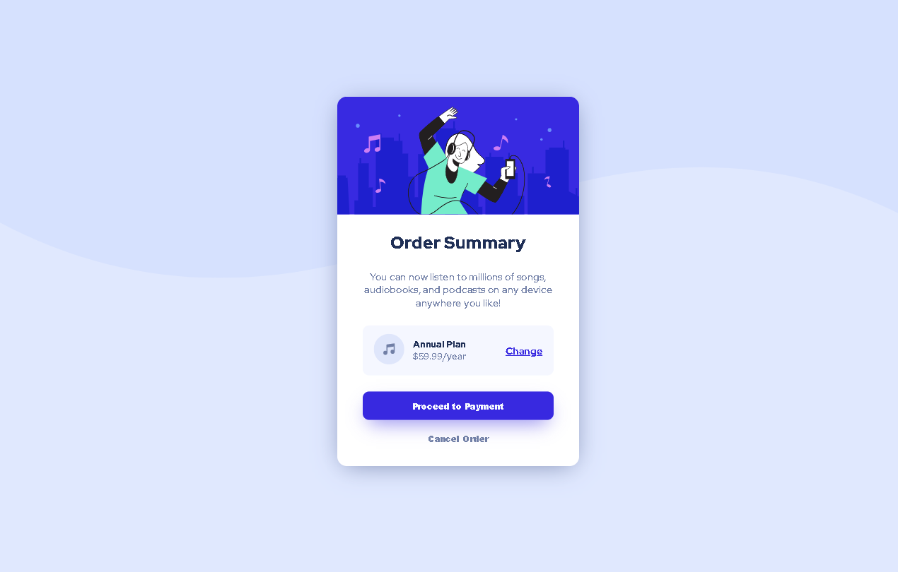
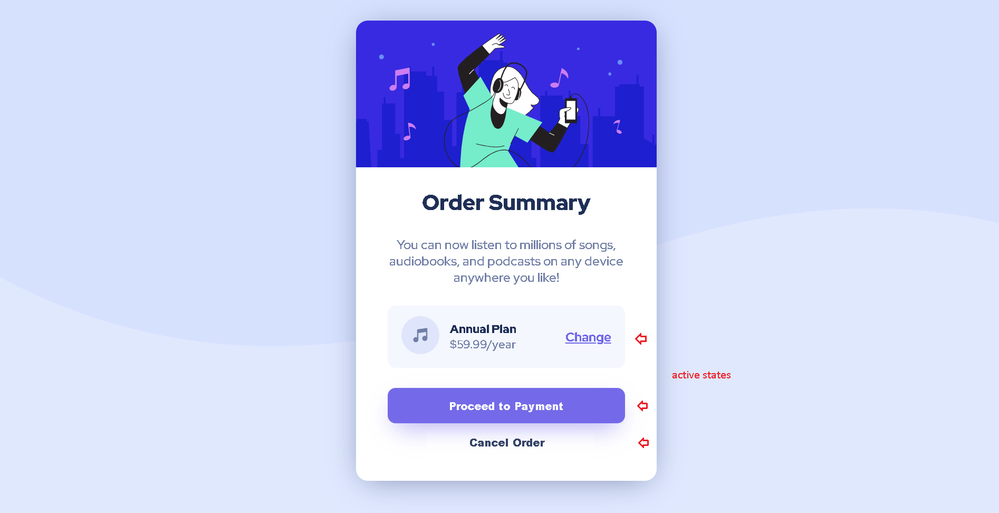

# Frontend Mentor - Order summary card solution

This is a solution to the [Order summary card challenge on Frontend Mentor](https://www.frontendmentor.io/challenges/order-summary-component-QlPmajDUj). Frontend Mentor challenges help you improve your coding skills by building realistic projects.

## Table of contents

- [Frontend Mentor - Order summary card solution](#frontend-mentor---order-summary-card-solution)
  - [Table of contents](#table-of-contents)
  - [Overview](#overview)
    - [The challenge](#the-challenge)
    - [Screenshot](#screenshot)
    - [Links](#links)
  - [My process](#my-process)
    - [Built with](#built-with)
    - [What I learned](#what-i-learned)
    - [Continued development](#continued-development)
    - [Useful resources](#useful-resources)
  - [Author](#author)
  - [Acknowledgments](#acknowledgments)

**Note: Delete this note and update the table of contents based on what sections you keep.**

## Overview

### The challenge

Users should be able to:

- See hover states for interactive elements

### Screenshot

  
Large screen (1440px x 900px)

  
Active state

  
Small screen (375px x 667px)

### Links

- Solution URL: [Link to solution repository](https://github.com/rickyxyz/frontendmentor-projects/tree/main/order-summary-component-main)
- Live Site URL: [Link to live site](https://rickyxyz.github.io/frontendmentor-projects/order-summary-component-main/index.html)

## My process

### Built with

- Semantic HTML5 markup
- CSS custom properties
- Flexbox

### What I learned

With this challenge the first thing I noticed and learned is how to use SVG to make a divider in the background.


the divider for the background

At first my approach is to make the divider as a pseudo-element of the body and then placing the element on top of the body.
But then after some tinkering, I found out I can just set the SVG as a background image and achieve the same result.

```css
/* initial approach */
body::before {
  content: "";
  position: absolute;
  top: 0;
  height: 100%;
  width: 100vw;
  z-index: -1;
  background: url("./images/pattern-background-desktop.svg");
  background-repeat: repeat-x;
}
```

```css
/* second approach */
body {
  height: 100vh;

  background: url("./images/pattern-background-desktop.svg");
  background-repeat: repeat-x;
  ...;
}
```

Though I do not know which one is a more sensible approach when making odd shaped dividers.

Another hiccup I encountered during this challenge is how to pad items within a div. From the design images, I think the padding on the card content changes with the device size. I thought of 2 approaches, (1) To limit the size the content can expand to or (2) use relativ units as padding.

```css
/* approach 1 */
.card__content {
    ...
    max-width: 300px;
    ...
}
```

```css
/* approach 2 */
.card__content {
    ...
    padding: 0 1.9rem;
    ...
}
```

Ultimately I decided to use the second approach, because I think it react better to different screen sizes.

### Continued development

After finishing this challenge, I think I need to find out how other people do certain stuff, like making odd-shaped divider or determining how to pad item; So, I can figure out what are the common approaches to stuff.

### Useful resources

- [SVG background section divider](https://generatepress.com/forums/topic/svg-background-section-divider/) - This post helped me figure out the initial approach to making odd shaped divider.
- [CSS Tricks non rectangular headers](https://css-tricks.com/creating-non-rectangular-headers/) - This article helped me figure out I can just use the SVG as background image on the body directly.

## Author

- Website - [rickyxyz.github.io](https://rickyxyz.github.io/)
- Frontend Mentor - [@rickyxyz](https://www.frontendmentor.io/profile/rickyxyz)
