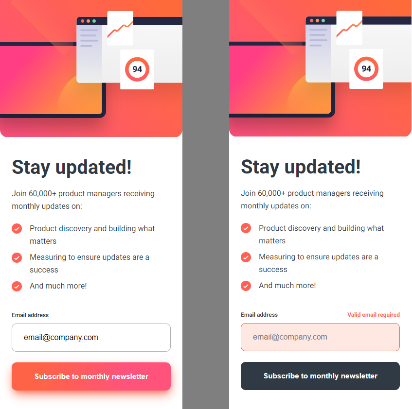

# Frontend Mentor - Newsletter sign-up form with success message solution

This is a solution to the [Newsletter sign-up form with success message challenge on Frontend Mentor](https://www.frontendmentor.io/challenges/newsletter-signup-form-with-success-message-3FC1AZbNrv). Frontend Mentor challenges help you improve your coding skills by building realistic projects.

## Table of contents

- [Overview](#overview)
  - [The challenge](#the-challenge)
  - [Screenshot](#screenshot)
  - [Links](#links)
- [My process](#my-process)
  - [Built with](#built-with)
  - [What I learned](#what-i-learned)
  - [Continued development](#continued-development)
  - [Useful resources](#useful-resources)
- [Author](#author)
- [Acknowledgments](#acknowledgments)

## Overview

### The challenge

Users should be able to:

- Add their email and submit the form
- See a success message with their email after successfully submitting the form
- See form validation messages if:
  - The field is left empty
  - The email address is not formatted correctly
- View the optimal layout for the interface depending on their device's screen size
- See hover and focus states for all interactive elements on the page

### Screenshot


Desktop acctive state


Desktop error state



Mobile active and error state

### Links

- Solution URL: [Link to solution repository](https://github.com/rickyxyz/frontendmentor-projects/tree/main/react/newsletter-sign-up-with-success-message-main)
- Live Site URL: [Link to live site](https://rickyxyz.dev/frontendmentor-projects/newsletter-sign-up-with-success-message-main/index.html)

## My process

### Built with

- Semantic HTML5 markup
- CSS custom properties
- Flexbox
- CSS Grid
- Mobile-first workflow
- [React](https://reactjs.org/) - JS library
- [Vite](https://vitejs.dev/) - Build tool

### What I learned

In this project, I learned how to do basic debouncing for the input validation. The validation is debounced so, th einput is only validated after the user has stopped typing.

```jsx
useEffect(() => {
  const timeout = setTimeout(() => {
    setIsError(email !== "" && !emailRegex.test(email));
  }, validationTimeout);

  return () => {
    clearTimeout(timeout);
  };
}, [email]);
```

### Continued development

I am still uncomfortable setting up a react project from scratch, I hope to improve on this.

### Useful resources

- [Debounce Input in React ](https://dev.to/manishkc104/debounce-input-in-react-3726) - This helped me implement the debouncing function

## Author

- Website - [rickyxyz.dev](https://rickyxyz.dev/)
- Frontend Mentor - [@rickyxyz](https://www.frontendmentor.io/profile/rickyxyz)
