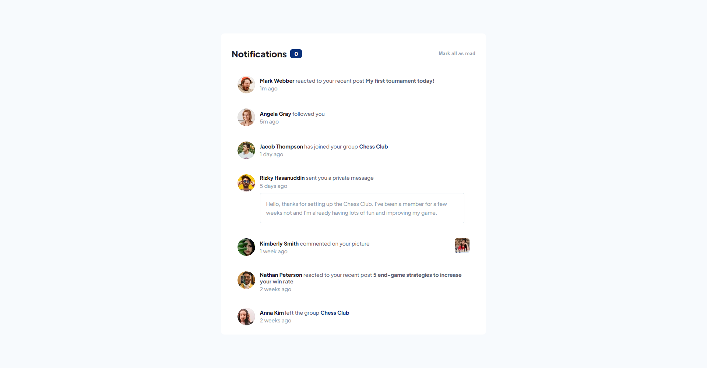

# Frontend Mentor - Notifications page solution

This is a solution to the [Notifications page challenge on Frontend Mentor](https://www.frontendmentor.io/challenges/notifications-page-DqK5QAmKbC). Frontend Mentor challenges help you improve your coding skills by building realistic projects.

## Table of contents

- [Overview](#overview)
  - [The challenge](#the-challenge)
  - [Screenshot](#screenshot)
  - [Links](#links)
- [My process](#my-process)
  - [Built with](#built-with)
  - [What I learned](#what-i-learned)
  - [Continued development](#continued-development)
  - [Useful resources](#useful-resources)
- [Author](#author)

## Overview

### The challenge

Users should be able to:

- Distinguish between "unread" and "read" notifications
- Select "Mark all as read" to toggle the visual state of the unread notifications and set the number of unread messages to zero
- View the optimal layout for the interface depending on their device's screen size
- See hover and focus states for all interactive elements on the page

### Screenshot



Desktop result


Read animation

### Links

- Solution URL: [Link to solution repository](https://github.com/rickyxyz/frontendmentor-projects/tree/main/react/notifications-page-main)
- Live Site URL: [Link to live site](https://rickyxyz.dev/frontendmentor-projects/notifications-page-main/index.html)

## My process

### Built with

- Semantic HTML5 markup
- CSS custom properties
- SASS
- Flexbox
- CSS Grid
- Mobile-first workflow
- [React](https://reactjs.org/) - JS library
- [ViteJs](https://vitejs.dev/) - Build tool

**Note: These are just examples. Delete this note and replace the list above with your own choices**

### What I learned

This one is quite straightforward to implement with React. Figuring out which color to use for which element wasn't so easy. Adding the read animation is also quite challenging, since it require the use of requestAnimationFrame which I'm not quite familiar with.

```jsx
// App.jsx
const handleReadAll = () => {
  if (unreadCount < 1) return;

  const duration = 110;
  let start = Date.now();
  const notificationPing = document.querySelectorAll(".notification__ping");
  const notifcationUnread = document.querySelectorAll(".notification-unread");

  // recursive function for the animation
  let animation = requestAnimationFrame(function readAnimation(timestamp) {
    let interval = Date.now() - start; // keep track of the animation progress

    // change the element style slowly
    notificationPing.forEach((p) => {
      p.style.opacity = 1 - interval / duration;
    });
    notifcationUnread.forEach((u) => {
      u.style.backgroundColor = `hsl(210, 60%, ${
        98 + (2 * interval) / duration
      }%)`;
    });

    if (interval < duration) requestAnimationFrame(readAnimation);
  });
  setTimeout(() => {
    setNotifications((ns) => ns.map((n) => ({ ...n, isUnread: false })));
  }, duration + 10);
};
```

### Continued development

I still plan to learn more about animation with JavaScript.

### Useful resources

- [How to Use requestAnimationFrame with React](https://www.pluralsight.com/guides/how-to-use-requestanimationframe-with-react) - I used this article to figure out how to use `requestAnimationFrame`

## Author

- Website - [rickyxyz.dev](https://rickyxyz.dev/)
- Frontend Mentor - [@rickyxyz](https://www.frontendmentor.io/profile/rickyxyz)
