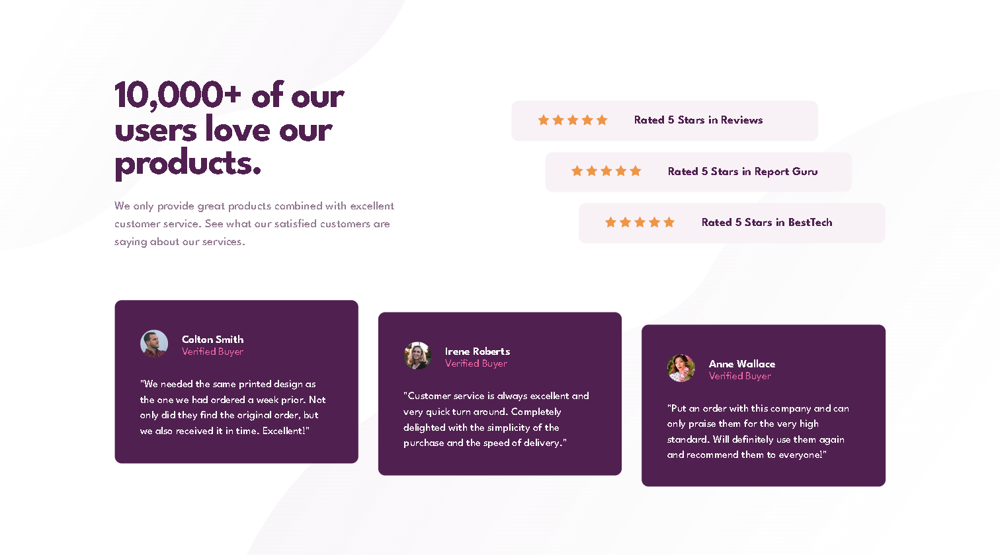

# Frontend Mentor - Social proof section solution

This is a solution to the [Social proof section challenge on Frontend Mentor](https://www.frontendmentor.io/challenges/social-proof-section-6e0qTv_bA). Frontend Mentor challenges help you improve your coding skills by building realistic projects.

## Table of contents

- [Overview](#overview)
  - [The challenge](#the-challenge)
  - [Screenshot](#screenshot)
  - [Links](#links)
- [My process](#my-process)
  - [Built with](#built-with)
  - [What I learned](#what-i-learned)
  - [Continued development](#continued-development)
  - [Useful resources](#useful-resources)
- [Author](#author)

## Overview

### The challenge

Users should be able to:

- View the optimal layout for the section depending on their device's screen size

### Screenshot

result on desktop (above 1000px in width)

result on mobile (below 1000px in width)

### Links

- Solution URL: [Link to solution repository](https://github.com/rickyxyz/frontendmentor-projects/tree/main/social-proof-section)
- Live Site URL: [Link to live site](https://rickyxyz.dev/frontendmentor-projects/social-proof-section/index.html)

## My process

### Built with

- Semantic HTML5 markup
- CSS custom properties
- Flexbox
- CSS Grid
- Mobile-first workflow

### What I learned

Thus far, this is the most convoluted project I have made in terms of CSS styling. At first, since I wanted to learn grid in CSS I tried to build this using grids. However, due to lack of knowledge the result isn't really responsive. So, I tried using a combination of grids and flexboxes to make the website more responsive in my second attempt.

On my second attempt, I tried to build the challenge in mobile layout first and then added the css for desktop sizes. I found this approach is easier for this challenge (or maybe mobile-first approach makes development easier in general). This is the first challenge that I approach using a mobile-first thinking.

### Continued development

Firstly, I would like to be better at CSS grids. I don't know how many times I needed to look at CSS grid reference during this challenge. Secondly, I would like to try more problems with a mobile-first approach, since it might make the development process easier.

### Useful resources

- [CSS-Tricks: A Complete Guide to Grid](https://css-tricks.com/snippets/css/complete-guide-grid/) - Once in a while, I took a peek to this site when I need a reference on some grid properties.

- [5 simple tips to making responsive layouts the easy way](https://youtu.be/VQraviuwbzU) - This video helped me to approach the problem from another angle on my second try styling this challenge.

## Author

- Website - [rickyxyz.dev](https://www.rickyxyz.github.io)
- Frontend Mentor - [@rickyxyz](https://www.frontendmentor.io/profile/rickyxyz)
